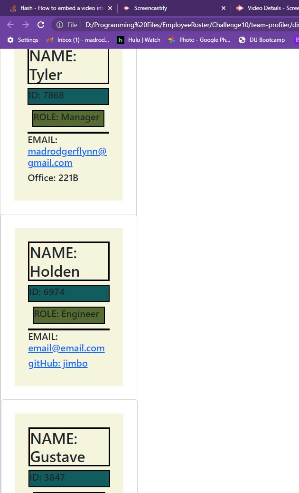

# Team Member Profiler

## Description

---

This is an application that a User can use to create a team consisting of 3 seperate profiles.

### Table of Contents

---

- [Installation](#installation)
- [Usage](#usage)
- [Contributors](#contributors)
- [Tests](#tests)
- [Questions](#questions)

### Installation

---

To install necessary dependencies, follow these steps:
You must run the application in the terminal.

## Usage

---

Simply start by entering 'node index.js' in the terminal and answer the questions provided for each member of your team.

## Contributors

---

None.

---

## Screenshot

---

## Tests

---

Ran tests making sure id, username, and email worked as they should

## Questions

---

For any questions about this project, contact me directly at madrodgerflynn@gmail.com You can find more of my work on my Github @ [madrodgerflynn](https://github.com/madrodgerflynn).

---

## Recording Link

(https://drive.google.com/file/d/1rFzZEijWkmw6Aot5l5iGHWLiKjF5ku86/view)
